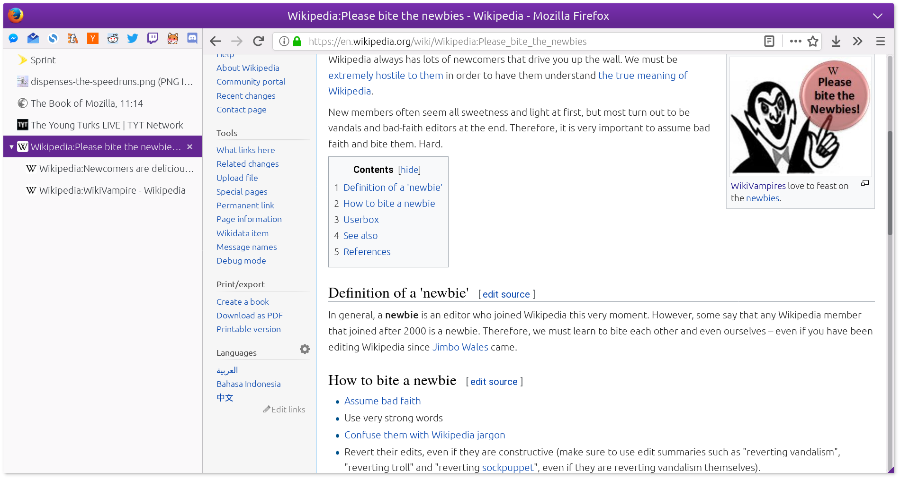

userChrome.css tweaks for Firefox 57+
=====================================

Installation
------------

1.  Make the `<profile>/chrome` directory if it doesn't already exist.
2.  Clone the repository inside that directory.
3.  **If you already have a `userChrome.css` file, move it into the `userChrome.css.d`
    directory UNDER A DIFFERENT FILENAME.**
4.  Run `make` inside `userChrome.css.d`.
5.  Symlink `userChrome.css.d` into the `chrome` directory.

Also included is a Tree Style Tab stylesheet at `_tst.css`.  To use it with the
WebExtension version of TST, simply paste it into the "Extra style rules for sidebar
contents" text box in the Advanced section of TST's preferences and select the
"Vertigo" theme.

Adding/changing/removing stylesheets
------------------------------------

Whenever you add, change, or remove a stylesheet, restart the browser.  If you added
or removed stylesheets, run `make` first.

The generated `userChrome.css` file is just a list of `@import`s.  Therefore, you only
need to run `make` when adding or removing stylesheets.
